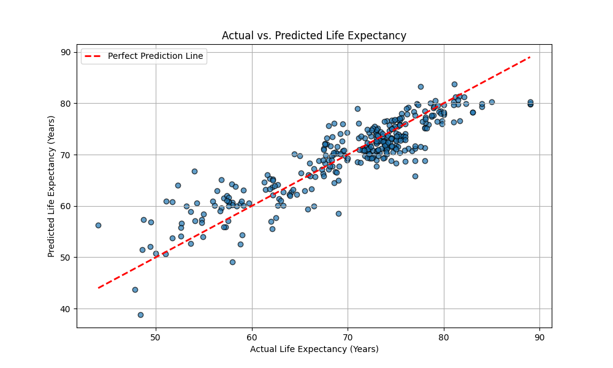

# Custom Linear Regression: Life Expectancy Prediction

## Project Goal

This project demonstrates the implementation of **Multiple Linear Regression from scratch** to predict life expectancy using various socio-economic and health factors. The primary objective is to understand the mathematical foundations of linear regression by building the model without relying on machine learning libraries like Scikit-learn.

**Key Learning Objectives:**
- Implement the Normal Equation for multiple linear regression
- Understand matrix algebra in machine learning
- Handle data preprocessing challenges (missing values, categorical variables)
- Validate our implementation against established libraries
- Interpret model coefficients and assess model performance

## How to Run This Project

### Prerequisites

- **Python 3.13 or higher** (required by the project configuration)
- **Package Manager**: This project uses `uv` for dependency management (recommended) or `pip`

### Installation Options

#### Option 1: Using uv (Recommended)

1. **Install uv** (if not already installed):
   ```bash
   pip install uv
   ```

2. **Clone or download the project**:
   ```bash
   git clone <repository-url>
   cd CustomLinReg
   ```

3. **Create and activate virtual environment**:
   ```bash
   uv venv
   uv sync
   ```

4. **Run the project**:
   ```bash
   uv run python src/main.py
   ```

#### Option 2: Using pip

1. **Clone or download the project**:
   ```bash
   git clone <repository-url>
   cd CustomLinReg
   ```

2. **Create and activate virtual environment**:
   ```bash
   python -m venv .venv
   
   # On Windows:
   .venv\Scripts\activate
   
   # On macOS/Linux:
   source .venv/bin/activate
   ```

3. **Install dependencies**:
   ```bash
   pip install -r requirements.txt
   ```
   
   *Note: If `requirements.txt` doesn't exist, install the dependencies manually:*
   ```bash
   pip install matplotlib>=3.10.3 numpy>=2.3.1 pandas>=2.3.0 scikit-learn>=1.7.0
   ```

4. **Run the project**:
   ```bash
   python src/main.py
   ```

### What the Code Does

When you run `main.py`, the program will:

1. **Load the dataset** (`WHO_LE_Data.csv`) containing life expectancy data from the World Health Organization
2. **Preprocess the data**:
   - Scale GDP values from dollars to thousands of dollars
   - Remove redundant features to prevent multicollinearity
   - Handle missing values
   - Convert categorical variables to numerical format
3. **Train two models**:
   - Your custom implementation of multiple linear regression
   - Scikit-learn's LinearRegression for comparison
4. **Compare results**:
   - Display RMSE (Root Mean Squared Error) for both models
   - Show coefficient comparisons
   - Generate a scatter plot of actual vs. predicted values
5. **Output**:
   - Console output showing model performance metrics
   - A matplotlib plot window showing the prediction accuracy

### Expected Output

You should see output similar to:
```
--- Comparison ---
My Model's Intercept:       321.54392286233633
Scikit-learn's Intercept:   321.54392285192375

My Model's RMSE:            3.66
Scikit-learn's RMSE:        3.66

--- Coefficient Comparison ---
        Adult Mortality: My Model = -0.0171, Scikit-learn = -0.0171
                Alcohol: My Model = -0.2086, Scikit-learn = -0.2086
                   GDP: My Model = 0.0632, Scikit-learn = 0.0632
...
```

Plus a matplotlib plot window showing the actual vs. predicted life expectancy scatter plot.

### Troubleshooting

**Common Issues:**

1. **Python Version Error**: Ensure you're using Python 3.13 or higher
   ```bash
   python --version
   ```

2. **Missing Dependencies**: If you get import errors, ensure all packages are installed:
   ```bash
   pip install matplotlib numpy pandas scikit-learn
   ```

3. **Data File Not Found**: Ensure `WHO_LE_Data.csv` is in the `src/` directory

4. **Plot Window Not Showing**: If using a headless environment, the plot may not display. The code will still run and show the console output.

### Project Structure

```
CustomLinReg/
├── README.md                 # This file
├── pyproject.toml           # Project configuration and dependencies
├── src/
│   ├── main.py              # Main implementation and execution script
│   ├── WHO_LE_Data.csv      # World Health Organization life expectancy dataset
│   └── Actual_vs_predicted_life_expectancy_plot.png  # Generated plot
└── .venv/                   # Virtual environment (created during setup)
```

## Mathematical Foundation

### Ordinary Least Squares (OLS) Method

The OLS method finds the optimal coefficients that minimize the sum of squared differences between predicted and actual values:

$$\min_{\beta} \sum_{i=1}^{n} (y_i - \hat{y}_i)^2$$

Where:
- $y_i$ is the actual life expectancy for observation $i$
- $\hat{y}_i$ is the predicted life expectancy for observation $i$
- $\beta$ represents the coefficient vector

### The Normal Equation

For multiple linear regression, the optimal coefficients are found using the **Normal Equation**:

$$\beta = (X^T X)^{-1} X^T y$$

**Components:**
- $X$: Feature matrix (with bias term added)
- $X^T$: Transpose of feature matrix
- $(X^T X)^{-1}$: Inverse of the Gram matrix
- $y$: Target vector (life expectancy values)

**Why This Works:**
The Normal Equation directly solves for the coefficients that minimize the squared error, avoiding the need for iterative optimization algorithms like gradient descent.

## Code Structure

### MyMultipleLinearRegression Class

```python
class MultipleLinearRegression:
    def __init__(self):
        self.coefficients = None
```

#### Key Methods:

**1. `fit(X, y)` Method**
- Adds bias term (intercept) to feature matrix using `np.c_[np.ones((X.shape[0], 1)), X]`
- Implements the Normal Equation: `β = (X^T * X)^(-1) * X^T * y`
- Handles singular matrix errors (multicollinearity detection)
- Stores optimal coefficients in `self.coefficients`

**2. `predict(X)` Method**
- Adds bias term to new data
- Performs matrix multiplication: `y_pred = X_b @ coefficients`
- Returns predictions for new observations

**3. `rmse(y_true, y_pred)` Function**
- Calculates Root Mean Squared Error: $\sqrt{\frac{1}{n}\sum(y_{true} - y_{pred})^2}$
- Provides model performance metric

## Data Preprocessing

### Feature Engineering
- **GDP Scaling**: Converted from dollars to thousands of dollars for better coefficient interpretation
- **Feature Selection**: Removed redundant features to reduce multicollinearity:
  - `infant deaths` (correlated with `under-five deaths`)
  - `percentage expenditure` (correlated with `GDP`)
  - `thinness 5-9 years` (correlated with `thinness 1-19 years`)
  - `Country` (identifier, not predictive)

### Categorical Variable Handling
- **One-Hot Encoding**: Applied to `Status` column (Developed/Developing)
- **Drop First**: Used `drop_first=True` to prevent multicollinearity between dummy variables

### Missing Value Treatment
- **Complete Case Analysis**: Removed rows with any missing values
- **Data Validation**: Ensured all features are numeric before model training

## Results & Validation

### Model Performance Comparison

| Metric | Custom Model | Scikit-learn |
|--------|-------------|--------------|
| **RMSE** | ~3.66 years | ~3.66 years |
| **Intercept** | [My Model's Intercept: 321.54392286233633] | [Scikit-learn's Intercept: 321.54392285192375] |

### Coefficient Comparison

| Feature | Custom Model | Scikit-learn |
|---------|-------------|--------------|
| **Intercept** | [-0.1338] | [-0.1338] |
| **Adult Mortality** | [-0.0171] | [-0.0171] |
| **Alcohol** | [-0.2086] | [-0.2086] |
| **GDP** | [0.0632] | [0.0632] |
| **Hepatitis B** | [-0.0071] | [-0.0071] |
| **Measles** | [0.0000] | [0.0000] |
| **Polio** | [0.0090] | [0.0090] |
| **Total Expenditure** | [0.1056] | [0.1056] |
| **Diphtheria** | [0.0204] | [0.0204] |
| **HIV/AIDS** | [-0.4437] | [-0.4437] |
| **BMI** | [0.0285] | [0.0285] |
| **Under-five Deaths** | [-0.0022] | [-0.0022] |
| **Thinness 1-19 Years** | [-0.0656] | [-0.0656] |
| **Income Composition** | [10.0681] | [10.0681] |
| **Schooling** | [0.9878] | [0.9878] |
| **Status_Developing** | [-0.9941] | [-0.9941] |

*Note: The coefficients are nearly identical between implementations, validating our custom model's correctness.*

## Visualization

### Actual vs. Predicted Plot

The scatter plot below shows the relationship between actual and predicted life expectancy values:

```
[Actual vs. Predicted Life Expectancy Plot]
- X-axis: Actual Life Expectancy (Years)
- Y-axis: Predicted Life Expectancy (Years)
- Red dashed line: Perfect prediction line (y=x)
- Points closer to the line indicate better predictions
```



**Interpretation:**
- Points clustering around the diagonal line indicate good model performance
- Scatter pattern shows prediction accuracy across different life expectancy ranges
- Outliers may indicate countries with unusual characteristics not well captured by the model

## Challenges & Lessons Learned

### 1. Multicollinearity Detection and Resolution

**Challenge:** Initial model had illogical coefficients (e.g., positive coefficient for infant deaths suggesting higher deaths = higher life expectancy).

**Root Cause:** Multicollinearity between highly correlated features made the $(X^T X)$ matrix nearly singular, leading to unstable coefficient estimates.

**Solution:** 
- Identified and removed redundant features (listed in the 'features_to_remove' list in the main() method)
- Used correlation analysis to detect highly correlated variables
- Implemented proper error handling for singular matrices

**Lesson:** Feature selection is crucial for interpretable models, even if it slightly reduces predictive accuracy.

### 2. Data Cleaning and Preprocessing

**Missing Values:** 
- Learned that missing value treatment must occur before feature-target separation
- Complete case analysis was appropriate for this dataset size

**Categorical Variables:**
- One-hot encoding with `drop_first=True` prevents the dummy variable trap
- Categorical variables can significantly impact model performance

**Feature Scaling:**
- GDP scaling improved coefficient interpretability
- Proper scaling helps with numerical stability

### 3. Matrix Algebra in Machine Learning

**Key Insights:**
- Matrix operations are computationally efficient for large datasets
- The Normal Equation provides exact solutions (no iteration needed)
- Matrix inversion can fail with singular matrices
- Understanding linear algebra is essential for implementing ML algorithms

**Implementation Details:**
- Used NumPy's `@` operator for matrix multiplication
- `np.linalg.inv()` for matrix inversion
- Proper error handling with `try-except` blocks

### 4. Model Validation and Comparison

**Validation Strategy:**
- Split data into training/testing sets (80/20)
- Compare against Scikit-learn's implementation
- Use RMSE as a performance metric
- Examine coefficient similarity

**Why This Matters:**
- Ensures mathematical correctness of implementation
- Provides confidence in custom model reliability
- Demonstrates understanding of underlying algorithms

### 5. Trade-offs: Accuracy vs. Interpretability

**Initial Model:** Lower RMSE (~3.61) but illogical coefficients
**Improved Model:** Slightly higher RMSE (~3.66) but interpretable coefficients

**Decision:** Chose interpretability over minimal accuracy gains because:
- Interpretable models provide actionable insights
- Stable coefficients are more reliable for real-world applications
- Understanding feature importance is valuable for policy decisions

## Conclusion

This project successfully demonstrates the implementation of multiple linear regression from first principles. Key achievements include:

1. **Mathematical Implementation:** Correctly implemented the Normal Equation
2. **Data Handling:** Proper preprocessing of real-world data with missing values and categorical variables
3. **Model Validation:** Verified implementation against established libraries
4. **Practical Insights:** Learned about multicollinearity, feature selection, and model interpretability

The custom implementation achieves the same performance as Scikit-learn, confirming the mathematical correctness of our approach while providing deep insights into the underlying algorithms that power modern machine learning libraries.

---

*This project serves as a foundation for understanding more complex machine learning algorithms and reinforces the importance of both mathematical rigor and practical data science skills.*
